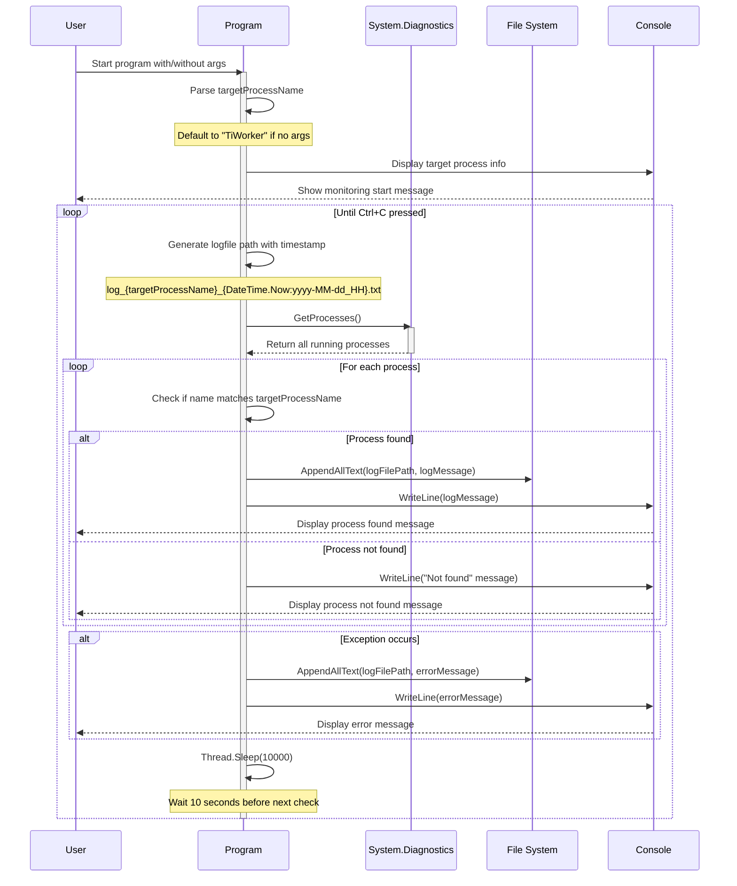

# 📱demoProcessChecker

- 檢查特定程序是否執行中，並進行紀錄
- 可帶入執行序名稱，預設為 `TiWorker`，會檢查 `TiWorker.exe`
- 使用文字檔紀錄，十秒檢查一次，一小時一個檔案，寫入 `*.log`

# 👾Development in CLI

```sh
mkdir demoProcessChecker
cd demoProcessChecker
git init
dotnet new gitignore

# create git remote and push

dotnet new console -n demoProcessChecker
cd demoProcessChecker
dotnet build
dotnet run

# Hello, World!

# write your own code
```

# 🏃‍➡️Use Case

```sh
# watch TiWorker.exe
demoProcessChecker

# watch other exe, e.g. vs2022
demoProcessChecker devenv
```

# 🕜Seq Diagram

