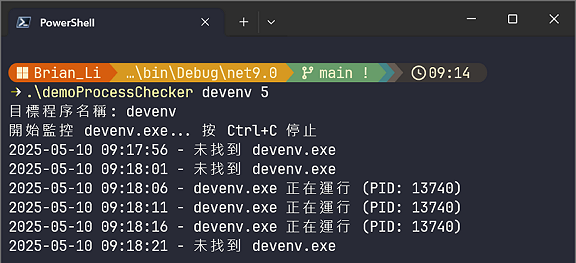
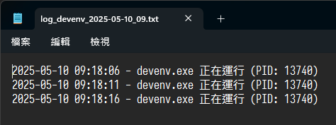

# 📱demoProcessChecker

- 檢查特定程序是否執行中，並進行紀錄
- 可帶入執行序名稱，預設為 `TiWorker`，會檢查 `TiWorker.exe`
- 五秒檢查一次寫入 `*.log`，一小時為單位生成一個檔案

# 👾Development in CLI

```sh
mkdir demoProcessChecker
cd demoProcessChecker
git init
dotnet new gitignore

# create git remote and push

dotnet new console -n demoProcessChecker
cd demoProcessChecker
dotnet build
dotnet run

# Hello, World!

# write your own code
```

# 🏃‍➡️Use Case

```sh
# watch TiWorker.exe, 5 sec/time
demoProcessChecker

# watch other exe, e.g. vs2022
demoProcessChecker devenv

# watch with custom interval, e.g. 60 sec/time
demoProcessChecker devenv 60
```

# 🖥️Screen Shot

## Running in Windows Terminal



- Always output the message, whether found or not.

## Log File



- Logging when the process is detected as running.

# 🕜Seq Diagram

